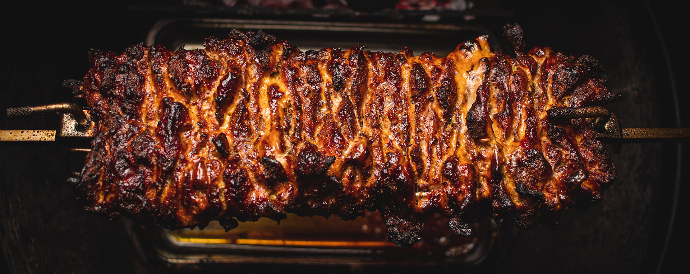

      <h2> </h2>
<h2><b>🌯 I LOVE SHAWARMA! 🌯</b></h2> 

 

   <h2> </h2>
<h4><b>👨‍💻 SOFTWARE DEVELOPER 👨‍💻</b></h4>
  
Hardworking <a href="https://42abudhabi.ae/" link=blank>42 Abu Dhabi</a> student dedicated to learning and developing programming skills.  
    Curious about VR/AR technologies and belief in the future of the metaverse.  
      Most interested in app and game development. 

      <h2> </h2>
<h4><b>🎙️ SINGER-SONGWRITER 🎙️</b></h4>
    
Performed as a drummer, guitarist, and vocalist at various self-organized concerts and festival events.  
      Wrote lyrics and music, performed and recorded, mixed and mastered,  
    released and promoted the full-length album <a href="https://band.link/Kw27o" link=blank>Sorrowcrafter</a>.

      <h2> </h2>
<h4><b>🔉 SOUND ENGINEER 🔉</b></h4>
      
Founded and managed own <a href="https://www.youtube.com/watch?v=T_haOsQ7Gf4" link=blank>Ambervox</a> recording studio, organized a full-stage sound  
        recording process to work with musicians and create high quality audio materials.  
        Produced, mixed and mastered a huge amount of audio for music bands and various corporate clients.

   <h2> </h2>
 
<b>&nbsp&nbsp</b>
 
<b>&nbsp&nbsp</b>
 

